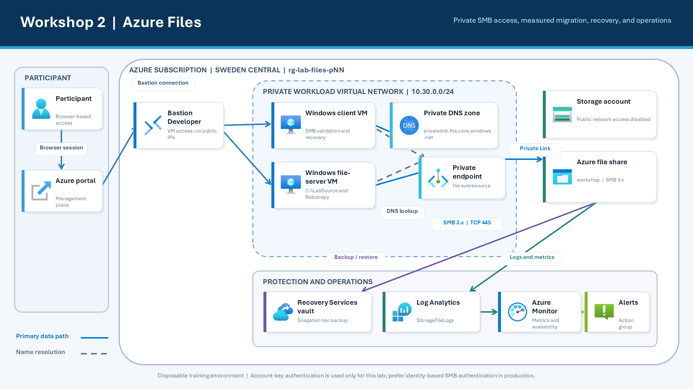

# Workshop 2: Azure Files

This workshop uses an isolated Azure environment. A Windows Server VM simulates a source file server, a second Windows Server VM acts as the client, and an SMB Azure file share is exposed only through a private endpoint. No customer-network connectivity is required.

Procedures and portal labels were checked against Microsoft Learn on **26 August 2026**. Azure portal experiences can change; the facilitator should recheck the linked Learn articles shortly before delivery.

## Outcomes

By the end of the workshop, participants can:

- Explain the protocol, performance, redundancy, and identity choices for Azure Files.
- Validate an SMB share that is reachable only through a private endpoint.
- Migrate a measured data set with Robocopy and verify the result.
- Recover data from a share snapshot and an Azure Backup recovery point.
- Interpret Azure Files metrics, logs, alerts, capacity, and throttling signals.
- Diagnose DNS, TCP 445, credentials, network access, permissions, and service health.
- Decide when Azure File Sync is appropriate.

> This disposable lab mounts SMB with a storage account key. Microsoft recommends identity-based authentication for production. Microsoft Entra Kerberos is a design discussion here because it requires tenant-level configuration and supported client identities.

## Schedule

| Time | Activity |
|---|---|
| 09:00-10:00 | Foundations and design decisions |
| 10:00-11:00 | Lab 1: Validate a private SMB share |
| 11:00-12:00 | Lab 2: Migrate and validate data |
| 12:00-13:00 | Lunch |
| 13:00-13:20 | Azure File Sync decision exercise |
| 13:20-14:20 | Lab 3: Protect and recover files |
| 14:20-15:20 | Lab 4: Harden, monitor, and troubleshoot |
| 15:20-16:20 | Lab 5: Incident scenarios |
| 16:20-16:45 | Review and cleanup |

## Architecture



## Assigned Environment

Replace `NN` with your two-digit participant number. Do not use another participant's subscription.

| Item | Assigned value |
|---|---|
| Participant | `pNN` |
| Subscription | Provided by facilitator |
| Region | `Sweden Central` |
| Resource group | `rg-lab-files-pNN` |
| Virtual network | `vnet-lab-files-pNN` |
| Subnet | `snet-workload` |
| Client VM | `vm-filesclient-pNN` |
| Source VM | `vm-fileserver-pNN` |
| Storage account | Provided by facilitator; begins `stfilespNN` |
| File share | `workshop` |
| Private endpoint | `pe-files-pNN` |
| Private DNS zone | `privatelink.file.core.windows.net` |
| Recovery Services vault | `rsv-lab-files-pNN` |
| Log Analytics workspace | `log-lab-files-pNN` |
| Action group | `ag-lab-files-pNN` |

## Sign In and Connect to the VMs

1. Open [Azure portal](https://portal.azure.com) in an InPrivate or Incognito window.
2. Sign in with the Workshop 2 account supplied by the facilitator and change the temporary password when prompted.
3. In the search box at the top of the portal, enter `Subscriptions`, and then select **Subscriptions** under **Services**.
4. In the subscription list, select the subscription provided by the facilitator. On its **Overview** page, confirm that the **Subscription ID** matches your assigned subscription.
5. In the portal search box, enter `Resource groups`, and then select **Resource groups** under **Services**.
6. If resource groups from several subscriptions are shown, select **Add filter**, choose **Subscription**, select only your assigned subscription, and then select **Apply**.
7. Select `rg-lab-files-pNN`. On the resource-group **Overview** page, locate these two virtual machines:
    - `vm-filesclient-pNN` - the client VM used first for SMB connectivity and recovery exercises.
    - `vm-fileserver-pNN` - the source VM used later for the Robocopy migration exercise.
8. Select `vm-filesclient-pNN`. On the VM **Overview** page, confirm that **Status** is **Running**. If it is stopped, select **Start** and wait until the status changes to **Running**.
9. Select **Connect > Bastion**.
10. For **Authentication Type**, select **VM Password**, enter the VM administrator credentials supplied by the facilitator, and select **Connect**.
11. Bastion Developer opens the Windows desktop in the browser and permits one VM connection at a time. When a later task requires `vm-fileserver-pNN`, disconnect from the client VM, return to `rg-lab-files-pNN`, open `vm-fileserver-pNN`, confirm that it is running, and repeat steps 9-10.

## Lab 1: Validate a Private SMB Share

**Time:** 60 minutes  
**Purpose:** Verify storage configuration, private endpoint routing, DNS, and SMB access before moving data.

### Task 1: Inspect the storage and share configuration

1. In the search box at the top of the Azure portal, enter `Storage accounts`.
2. Under **Services**, select **Storage accounts**.
3. In the storage-account list, select the account whose name begins with `stfilespNN`. Use the exact account name supplied by the facilitator.
4. On the storage-account **Overview** page, find the **Essentials** section.
5. In your workshop notes, record the values for **Performance**, **Replication**, **Account kind**, and **Location**.
6. In the storage account's left menu, under **Settings**, select **Configuration**.
7. On the **Configuration** page, verify each setting below. Do not change any setting.
    - **Secure transfer required** is **Enabled**.
    - **Minimum TLS version** is **Version 1.2** or later.
    - **Allow storage account key access** is **Enabled** for this disposable lab.
    - **Hierarchical namespace** is **Disabled**.
8. In the left menu, under **Data storage**, select **Classic file shares**.
9. In the file-share list, select the share named `workshop`.
10. On the share **Overview** page, record the values for **Protocol**, **Access tier**, and **Quota**.
11. Use the **Classic file shares** breadcrumb at the top of the page to return to the file-share list.
12. On the file-share page toolbar, select **Soft delete**.
13. In the **Soft delete** pane, confirm that soft delete is **Enabled** and the retention period is **7 days**. Close the pane without making changes.

**Evidence:** Record the storage settings and explain why account-key access is an exception for this lab rather than the production recommendation.

### Task 2: Inspect the private endpoint and DNS path

1. If the storage account is no longer open, use the portal search box to open **Storage accounts**, and then select your `stfilespNN...` account.
2. In the storage account's left menu, under **Security + networking**, select **Networking**.
3. On the **Firewalls and virtual networks** tab, find **Public network access** and confirm that it is **Disabled**. Do not change it.
4. At the top of the Networking page, select the **Private endpoint connections** tab.
5. In the connection list, find the row for `pe-files-pNN`.
6. Confirm that **Connection state** is **Approved** and **Subresource** is `file`.
7. Select the private endpoint name `pe-files-pNN` to open the private endpoint resource.
8. In the private endpoint's left menu, under **Settings**, select **DNS configuration**.
9. Record the **Private IP address**. It should be in the lab network range `10.30.0.0/24`.
10. In the portal search box, enter `Private DNS zones`, and then select **Private DNS zones** under **Services**.
11. Select the zone named `privatelink.file.core.windows.net`.
12. In the zone's left menu, select **Recordsets**.
13. Find the A record whose name matches your storage account. Confirm that its IP address is the same private endpoint address recorded in step 9.
14. In the zone's left menu, select **Virtual network links**.
15. Confirm that the link for `vnet-lab-files-pNN` is present and its **Link status** is **Completed**.

### Task 3: Validate DNS and TCP 445

1. Return to the Bastion browser tab connected to `vm-filesclient-pNN`.
2. If no client VM session is open, return to `rg-lab-files-pNN`, select `vm-filesclient-pNN`, and connect using **Connect > Bastion**.
3. On the Windows desktop, select **Start**, enter `Windows PowerShell`, and select **Windows PowerShell** from the search results.
4. Replace `<assigned-storage-account>` below with the complete storage account name supplied by the facilitator. Do not include angle brackets.
5. Paste the following commands into PowerShell, and then press **Enter**:

```powershell
$storageAccount = '<assigned-storage-account>'
$hostName = "$storageAccount.file.core.windows.net"
Resolve-DnsName $hostName
Test-NetConnection $hostName -Port 445
```

6. In the `Resolve-DnsName` output, confirm that the standard hostname points to a name ending in `privatelink.file.core.windows.net` and returns the private IP recorded in Task 2.
7. In the `Test-NetConnection` output, confirm that `RemotePort` is `445` and `TcpTestSucceeded` is `True`.
8. If the returned address is not the private endpoint IP or `TcpTestSucceeded` is `False`, stop and ask the facilitator for help before continuing.

> Always mount the standard `file.core.windows.net` hostname. Do not mount the `privatelink` hostname directly.

### Task 4: Mount the share

1. Return to the Azure portal tab.
2. In the portal search box, enter `Storage accounts`, select **Storage accounts**, and then select your `stfilespNN...` account.
3. In the storage account's left menu, under **Security + networking**, select **Access keys**.
4. At the top of the Access keys page, select **Show keys**.
5. Under **key1**, select the **Copy to clipboard** button next to **Key**. Do not place the key in notes, chat, or screenshots.
6. Return to the Bastion tab for `vm-filesclient-pNN` and the Windows PowerShell window opened in Task 3.
7. Confirm that `$storageAccount` still contains your assigned account name by running `$storageAccount`. If it is blank or incorrect, set it again.
8. Paste the following commands, and then press **Enter**:

```powershell
$storageAccount = '<assigned-storage-account>'
$shareName = 'workshop'
$key = Read-Host 'Paste storage account key' -AsSecureString
$credential = [pscredential]::new("Azure\$storageAccount", $key)
New-PSDrive -Name Z -PSProvider FileSystem `
    -Root "\\$storageAccount.file.core.windows.net\$shareName" `
    -Credential $credential -Persist
New-Item Z:\Department, Z:\Migration, Z:\Recovery -ItemType Directory -Force
Get-ChildItem Z:\
```

9. When PowerShell displays `Paste storage account key`, right-click once inside the PowerShell window to paste the key, and then press **Enter**. The key remains hidden while you type or paste it.
10. Confirm that the `Z:` drive is created and that `Department`, `Migration`, and `Recovery` appear in the `Get-ChildItem` output.
11. Create and read a client test file:

```powershell
Set-Content Z:\Department\client-test.txt 'Created from the client VM'
Get-Content Z:\Department\client-test.txt
```

12. Confirm that PowerShell displays `Created from the client VM`.
13. Close the client VM's Bastion browser tab. Bastion Developer supports only one active VM connection at a time.
14. In the Azure portal, return to `rg-lab-files-pNN` and select `vm-fileserver-pNN`.
15. On the source VM **Overview** page, confirm that **Status** is **Running**. If necessary, select **Start** and wait for **Running**.
16. Select **Connect > Bastion**, choose **VM Password**, enter the credentials supplied by the facilitator, and select **Connect**.
17. On the source VM desktop, select **Start**, enter `Windows PowerShell`, and open **Windows PowerShell**.
18. Repeat steps 7-10 on the source VM using the same storage account name and a newly copied storage key.
19. Verify that the source VM can read the test file created by the client VM:

```powershell
Get-Content Z:\Department\client-test.txt
```

20. Confirm that the output is `Created from the client VM`. Leave this PowerShell window open for Lab 2.

**Pass criteria:** Both VMs resolve the private endpoint, TCP 445 succeeds, and each can create and read a test file through `Z:`.

## Lab 2: Migrate and Validate Data

**Time:** 60 minutes  
**Purpose:** Perform a measured and verifiable migration from the simulated source server.

### Task 1: Inventory the source

1. Continue in the Bastion session for `vm-fileserver-pNN` that you opened at the end of Lab 1.
2. If that session is closed, return to `rg-lab-files-pNN`, select `vm-fileserver-pNN`, select **Connect > Bastion**, and sign in using the VM credentials supplied by the facilitator.
3. On the Windows desktop, select **Start**, enter `Windows PowerShell`, and open **Windows PowerShell**.
4. Confirm that the `Z:` drive is mounted by running `Get-PSDrive Z`. If PowerShell reports that drive `Z` does not exist, repeat the mount procedure from Lab 1, Task 4 before continuing.
5. The pre-stage process created nested paths, an empty folder, long names, text files, and a 5 MiB binary file under `C:\LabSource`. Paste the following inventory commands into PowerShell, and then press **Enter**:

```powershell
$source = 'C:\LabSource'
$sourceFiles = Get-ChildItem $source -File -Recurse
$sourceInventory = [pscustomobject]@{
    FileCount   = $sourceFiles.Count
    FolderCount = (Get-ChildItem $source -Directory -Recurse).Count
    TotalBytes  = ($sourceFiles | Measure-Object Length -Sum).Sum
    LargestFile = ($sourceFiles | Sort-Object Length -Descending | Select-Object -First 1).FullName
}
$sourceInventory | Format-List
```

6. Record the four displayed values in your workshop notes.
7. For the standard lab dataset, confirm that **FileCount** is `42`, **FolderCount** is `11`, and **TotalBytes** is `5348317`. If these values differ, record the actual values and ask the facilitator before continuing.
8. In your notes, identify one business process that might keep files open and therefore require a planned cutover window during a real migration.

### Task 2: Run the initial copy

1. Stay in the PowerShell window on `vm-fileserver-pNN`.
2. Paste the following commands, and then press **Enter**. The copy may take a few minutes:

```powershell
$log = 'C:\LabLogs\robocopy-initial.log'
New-Item -ItemType Directory -Path (Split-Path $log) -Force | Out-Null
$stopwatch = [Diagnostics.Stopwatch]::StartNew()
robocopy C:\LabSource Z:\Migration /E /COPY:DAT /DCOPY:DAT /R:2 /W:2 /MT:8 /TEE /LOG:$log
$exitCode = $LASTEXITCODE
$stopwatch.Stop()
[pscustomobject]@{
    RobocopyExitCode = $exitCode
    ElapsedSeconds   = [math]::Round($stopwatch.Elapsed.TotalSeconds, 2)
}
```

3. Wait until the PowerShell prompt returns and the summary object displays **RobocopyExitCode** and **ElapsedSeconds**.
4. Confirm that **RobocopyExitCode** is between `0` and `7`. These values indicate success or an informational result. A value of `8` or higher indicates at least one failed copy; stop and ask the facilitator for help.
5. Review the last 20 lines of the saved log:

```powershell
Get-Content C:\LabLogs\robocopy-initial.log -Tail 20
```

6. In the robocopy summary, find the **Files** row and confirm that the **Failed** count is `0`.
7. Record **Copied**, **Skipped**, **Mismatch**, **Failed**, **Extras**, **RobocopyExitCode**, and **ElapsedSeconds** in your workshop notes.

### Task 3: Validate counts, bytes, and hashes

1. Stay in the PowerShell window on `vm-fileserver-pNN`.
2. Paste the following validation commands, and then press **Enter**:

```powershell
$destination = 'Z:\Migration'
$destinationFiles = Get-ChildItem $destination -File -Recurse
$destinationInventory = [pscustomobject]@{
    FileCount   = $destinationFiles.Count
    FolderCount = (Get-ChildItem $destination -Directory -Recurse).Count
    TotalBytes  = ($destinationFiles | Measure-Object Length -Sum).Sum
}
$sourceInventory
$destinationInventory

$sourceHashes = Get-ChildItem C:\LabSource -File -Recurse | ForEach-Object {
    [pscustomobject]@{
        RelativePath = $_.FullName.Substring('C:\LabSource'.Length)
        Hash = (Get-FileHash $_.FullName -Algorithm SHA256).Hash
    }
}
$destinationHashes = Get-ChildItem Z:\Migration -File -Recurse | ForEach-Object {
    [pscustomobject]@{
        RelativePath = $_.FullName.Substring('Z:\Migration'.Length)
        Hash = (Get-FileHash $_.FullName -Algorithm SHA256).Hash
    }
}
Compare-Object $sourceHashes $destinationHashes -Property RelativePath, Hash
```

3. Compare the displayed source and destination inventories. Confirm that **FileCount**, **FolderCount**, and **TotalBytes** have the same values on both sides.
4. Look immediately below the `Compare-Object` command. The expected result is no output followed by a new PowerShell prompt; this means every relative path and SHA256 hash matches.
5. If the inventory values differ or `Compare-Object` displays any rows, do not continue. Run `Get-Content C:\LabLogs\robocopy-initial.log -Tail 30`, record the output, and ask the facilitator for help.

### Task 4: Run a delta copy

1. Stay in the PowerShell window on `vm-fileserver-pNN`.
2. The next commands simulate three changes after the initial migration: one modified file, one new file, and one deleted source file.
3. Paste the following commands, and then press **Enter**:

```powershell
Add-Content C:\LabSource\Finance\sample-003.txt 'Delta change'
Set-Content C:\LabSource\Finance\new-after-initial.txt 'New file'
Remove-Item C:\LabSource\HR\Policies\sample-002.txt -ErrorAction SilentlyContinue
robocopy C:\LabSource Z:\Migration /E /COPY:DAT /DCOPY:DAT /R:2 /W:2 /MT:8 /TEE /LOG:C:\LabLogs\robocopy-delta.log
"Robocopy exit code: $LASTEXITCODE"
```

4. Wait for the robocopy summary and confirm that the exit code is between `0` and `7` and the **Failed** count is `0`.
5. Review the saved delta log:

```powershell
Get-Content C:\LabLogs\robocopy-delta.log -Tail 20
```

6. Confirm that changed files were copied and unchanged files were skipped.
7. Confirm that the source deletion was not repeated at the destination:

```powershell
Test-Path Z:\Migration\HR\Policies\sample-002.txt
```

8. Confirm that the command returns `True`. The destination file remains because `/MIR` was deliberately not used.
9. In your notes, describe the safe real-world sequence: schedule downtime, stop writes, run a final delta copy, validate the destination, switch users to Azure Files, and keep the source available for rollback until acceptance is complete.

**Pass criteria:** Initial counts, bytes, and hashes match; the delta run copies changed files; and the participant can explain how downtime, final delta, validation, and rollback fit into cutover.

## Azure File Sync Decision Exercise

**Time:** 20 minutes, facilitator-led. No deployment.

1. In your workshop notes, write the question: **After migration, will Windows file servers remain in the environment?**
2. If the answer is **Yes**, record whether local caching, branch-office access, or a low-downtime transition is required. These are reasons to consider Azure File Sync.
3. If the answer is **No**, record **Direct Azure Files access** as the simpler target. Use a measured copy method such as Robocopy or AzCopy and avoid a permanent synchronization dependency.
4. Record that cloud tiering manages local disk capacity but does not replace backup.
5. Record the operational work introduced by Azure File Sync: agent updates, server registration, sync-health monitoring, files-not-syncing investigation, cloud-tiering policy tuning, and file recall planning.
6. When asked by the facilitator, state your decision and give the single requirement that most strongly supports it.

## Lab 3: Protect and Recover Files

**Time:** 60 minutes  
**Purpose:** Compare self-managed snapshots with policy-managed snapshot-tier Azure Backup.

### Task 1: Create and use a share snapshot

1. Close the Bastion tab for `vm-fileserver-pNN` if it is still open.
2. In the Azure portal, open `rg-lab-files-pNN`, and then select `vm-filesclient-pNN`.
3. Confirm that the VM status is **Running**, select **Connect > Bastion**, and sign in using the VM credentials supplied by the facilitator.
4. On the client VM desktop, select **Start**, enter `Windows PowerShell`, and open **Windows PowerShell**.
5. Confirm that drive `Z:` is mounted by running `Get-PSDrive Z`. If it is missing, repeat the mount procedure from Lab 1, Task 4.
6. Paste the following commands to create two recovery test files, and then press **Enter**:

```powershell
New-Item Z:\Recovery -ItemType Directory -Force | Out-Null
Set-Content Z:\Recovery\quarterly-plan.txt 'Quarterly plan version 1'
Set-Content Z:\Recovery\delete-me.txt 'Snapshot recovery sample'
```

7. Confirm both files contain version 1 data:

```powershell
Get-Content Z:\Recovery\quarterly-plan.txt
Get-Content Z:\Recovery\delete-me.txt
```

8. Return to the Azure portal tab. In the portal search box, enter `Storage accounts`, select **Storage accounts**, and then select your `stfilespNN...` account.
9. In the storage account's left menu, under **Data storage**, select **Classic file shares**.
10. Select the `workshop` share.
11. In the share's left menu, under **Operations**, select **Snapshots**.
12. On the toolbar, select **+ Add snapshot**.
13. In the pane, enter `Before Lab 3 changes` in **Comment**, and then select **OK** or **Create**. Wait for the success notification.
14. Return to the client VM PowerShell window and simulate a changed and deleted file:

```powershell
Set-Content Z:\Recovery\quarterly-plan.txt 'Quarterly plan version 2'
Remove-Item Z:\Recovery\delete-me.txt
Get-ChildItem Z:\Recovery
```

15. Confirm that `quarterly-plan.txt` remains and `delete-me.txt` is no longer listed.
16. Return to the portal's **Snapshots** page and select **Refresh** if the new snapshot is not visible.
17. Select the snapshot with comment `Before Lab 3 changes`.
18. In the snapshot file browser, select the `Recovery` folder and then select `quarterly-plan.txt`.
19. Select **Download**. The portal runs in your local browser, so the file is saved to your local computer's Downloads folder, not to the Bastion VM.
20. Open the downloaded file locally and confirm its content is `Quarterly plan version 1`. Rename it locally to `quarterly-plan-snapshot.txt` so it cannot be confused with the live version.
21. Do not select **Restore > Overwrite original file** in this exercise. That action replaces the live file and should be used only with explicit approval.
22. Return to the Bastion client VM. Open **File Explorer**, browse to `Z:\Recovery`, right-click the folder, and select **Properties**.
23. If **Previous Versions** is available, select the snapshot created in step 13, select **Open**, copy `delete-me.txt`, and paste it into the live `Z:\Recovery` folder as `delete-me-restored.txt`.
24. If **Previous Versions** is absent or no snapshot is listed, record that observation and continue to Task 2. Do not treat it as a lab failure because client and portal versions can expose the feature differently.

### Task 2: Inspect Azure Backup protection

1. In the Azure portal search box, enter `rsv-lab-files-pNN`, replacing `NN` with your participant number.
2. Select the Recovery Services vault `rsv-lab-files-pNN` from the search results.
3. On the vault **Overview** page, select **Backup** from the toolbar or the left menu.
4. Find the protected datasource. Depending on the current portal version, its type can appear as **Azure Files (Azure Storage)** or **Azure Storage (Azure Files)**. Both labels refer to the Azure file share.
5. In the vault's left menu, under **Resiliency**, select **Protected inventory**, and then select **Protected items**.
6. At the top of the protected-items list, set **Datasource type** to **Azure Storage (Azure Files)**. If the portal uses the reverse label, select **Azure Files (Azure Storage)** instead.
7. Select the protected item for the `workshop` share.
8. On its details page, confirm that **Protection status** is healthy or protected and that the policy is `pol-files-snapshot-lab`.
9. Select the policy name and confirm that the backup tier is **Snapshot** and retention is **7 days**. Use the browser's **Back** button once to return to the protected item.
10. On the protected-item toolbar, select **Backup now**.
11. In the **Backup now** pane, set **Retain backup till** to a date seven days from today, and then select **OK** or **Backup now**.
12. Wait for the notification that the backup job was submitted.
13. In the vault's left menu, under **Resiliency**, select **Monitoring + Reporting**, and then select **Jobs**.
14. Find the newest Azure Files backup job. Select **Refresh** periodically until **Status** changes from **In progress** to **Completed**.
15. If the job changes to **Failed** or **Completed with warnings**, select the job, record the error details, and ask the facilitator before continuing.

### Task 3: Restore an individual file to an alternate location

1. In the Recovery Services vault's left menu, under **Resiliency**, select **Protected inventory**, and then select **Protected items**.
2. Set **Datasource type** to the Azure Files label used by your portal.
3. Select the protected `workshop` item.
4. On the protected-item toolbar, select **File Recovery**. If the toolbar is collapsed, select the ellipsis (**...**) and then **File Recovery**.
5. Under **Restore Point**, select **Select**.
6. In the recovery-point pane, select the newest completed snapshot-tier recovery point, and then select **OK**.
7. Under **Recovery Destination**, select **Alternate Location**.
8. In **Storage account**, select your assigned `stfilespNN...` account.
9. In **File share**, select `workshop`.
10. In **Folder Name**, enter `BackupRestore`.
11. Select **Add File**.
12. In the file browser, open `Recovery`, select `quarterly-plan.txt`, and then select **Select**.
13. For conflict resolution, select **Skip** unless the facilitator directs otherwise. This prevents an existing destination file from being overwritten.
14. Review the recovery point, destination, and selected file, and then select **Restore**.
15. Wait for the notification that the restore job was submitted.
16. In the vault's left menu, under **Resiliency**, select **Monitoring + Reporting**, and then select **Jobs**.
17. Find the newest restore job and select **Refresh** until **Status** is **Completed**. If it fails or completes with warnings, select the job, record the error, and ask the facilitator.
18. Return to the Bastion tab connected to `vm-filesclient-pNN` and open Windows PowerShell if needed.
19. Locate the recovered file and compare its content with the current live file:

```powershell
Get-ChildItem Z:\BackupRestore -File -Recurse
Get-Content Z:\Recovery\quarterly-plan.txt
Get-Content (Get-ChildItem Z:\BackupRestore -Filter quarterly-plan.txt -File -Recurse | Select-Object -First 1).FullName
```

20. Confirm that the live file contains `Quarterly plan version 2` and the restored copy contains `Quarterly plan version 1`.
21. Record the recovery-point time and alternate destination in your workshop notes.

**Pass criteria:** A deleted or changed item is recovered without unintentionally overwriting current data, and the participant identifies the recovery point and destination used.

## Lab 4: Harden, Monitor, and Troubleshoot

**Time:** 60 minutes  
**Purpose:** Review security controls and investigate the client, network, service, and capacity layers.

### Task 1: Review hardening controls

1. In the Azure portal search box, enter `Storage accounts`, select **Storage accounts**, and then select your `stfilespNN...` account.
2. In the storage account's left menu, under **Security + networking**, select **Networking**.
3. On **Firewalls and virtual networks**, confirm that **Public network access** is **Disabled**.
4. Select the **Private endpoint connections** tab and confirm that `pe-files-pNN` is **Approved**.
5. In the left menu, under **Settings**, select **Configuration**.
6. Confirm that **Secure transfer required** is **Enabled** and **Minimum TLS version** is **Version 1.2** or later.
7. In the left menu, under **Data storage**, select **Classic file shares**.
8. On the file-share toolbar, select **Soft delete** and record the enabled state and retention period. Close the pane without making changes.
9. In the storage account's left menu, select **Access control (IAM)**.
10. Select the **Role assignments** tab and use the **Role** column to identify assignments that can read or manage the account. Record one relevant role and assignee without recording credentials.
11. In the left menu, under **Security + networking**, select **Access keys**.
12. Select **Rotate and synchronize keys** or its information link to review the guidance. Do not select a **Rotate key** button during the lab.
13. In your notes, list the production improvements: identity-based SMB authentication, least-privilege roles, protected key operations, and an inventory of applications that still require account keys.

### Task 2: Analyze metrics

> Azure Files metrics can be account-scoped or share-scoped. A **File Share** dimension can be unavailable for this pay-as-you-go share. If that dimension is absent, continue with account-scoped metrics and record the scope.

1. In the storage account's left menu, under **Monitoring**, select **Metrics**.
2. Above the chart, set the time range to **Last 30 minutes** and select **Apply**.
3. Select **+ Add metric**.
4. In **Metric Namespace**, select **File** or **File standard metrics**. Portal wording can vary.
5. In **Metric**, select **Transactions**. Leave **Aggregation** at its default value.
6. Select **Apply splitting**.
7. In **Values**, select **Response type**. If the portal permits a second split, also select **API name**, and then select **Apply**.
8. Review the chart and legend. Look for response types such as `ClientThrottleError` or `ServerBusy`; these should be absent or zero in the lab.
9. Remove the split or metric using its close (**x**) control.
10. Add and review these metrics one at a time: **Availability**, **Success E2E Latency**, **Success Server Latency**, **Ingress**, **Egress**, and **File Capacity**.
11. Compare **Success E2E Latency**, which includes the client path, with **Success Server Latency**, which measures service processing. A much larger E2E value, such as 500 ms versus 50 ms, points to delay outside the Azure Files service.
12. If **Apply splitting** offers a **File Share** dimension, select `workshop`. If it does not, leave the chart at account scope.
13. Record the metric scope, availability, both latency values, and whether any throttling response appeared.

### Task 3: Review diagnostics and alerts

1. In the storage account's left menu, under **Monitoring**, select **Diagnostic settings**.
2. Azure Storage can show separate services for blob, file, queue, and table. Select the row or link named **File** if a service-selection page appears.
3. In the diagnostic-settings list, select `diag-files-pNN`.
4. Confirm that all available log categories and **AllMetrics** are selected and that **Send to Log Analytics workspace** points to `log-lab-files-pNN`. Select **Discard changes** or use the browser's **Back** button; do not save changes.
5. In the storage account's left menu, under **Monitoring**, select **Alerts**.
6. Select **Alert rules**, and then select `alert-files-availability-pNN`.
7. Confirm that **Scope** is your storage account or its file service. If it names another account or resource group, stop and contact the facilitator.
8. Confirm the condition uses **Availability**, **Average**, **Less than**, threshold `99.9`, evaluation frequency **5 minutes**, and lookback period **1 hour**.
9. Select the **Actions** tab or section and confirm that the action group is `ag-lab-files-pNN`. It may intentionally have no notification receiver unless the facilitator supplied an email address.
10. Return to the Bastion tab connected to `vm-filesclient-pNN` and open Windows PowerShell if needed.
11. Run the following loop to generate SMB create and read operations for diagnostic logs:

```powershell
1..20 | ForEach-Object {
    Set-Content "Z:\Department\monitor-$_.txt" "monitor sample $_"
    Get-Content "Z:\Department\monitor-$_.txt" | Out-Null
}
```

12. Confirm the PowerShell prompt returns without red error text. Wait at least two minutes for log ingestion.
13. Return to the Azure portal. In the search box, enter `log-lab-files-pNN`, and then select the Log Analytics workspace with that name.
14. In the workspace's left menu, under **General**, select **Logs**.
15. If a **Queries hub** or welcome pane opens, close it using the **X** in its upper-right corner to show a blank query editor.
16. Above the editor, set **Time range** to **Last hour**.
17. Replace any text in the editor with the following query, and then select **Run**:

```kusto
StorageFileLogs
| where TimeGenerated > ago(1h)
| summarize Operations=count() by Protocol, OperationName, StatusText
| order by Operations desc
```

18. In the **Results** pane, confirm that a table appears with **Protocol**, **OperationName**, **StatusText**, and **Operations** columns. At least one row should have a positive operation count.
19. If no rows appear, wait another two to three minutes and select **Run** again. If the query displays an error, verify that the first line is exactly `StorageFileLogs`; if it remains unavailable after ten minutes, record the result and ask the facilitator.

### Task 4: Use the troubleshooting ladder

1. Use `vm-filesclient-pNN` unless the facilitator names a different VM. Open Windows PowerShell using **Start > Windows PowerShell**.
2. Set the assigned account name, and then test name resolution:

```powershell
$storageAccount = '<assigned-storage-account>'
$hostName = "$storageAccount.file.core.windows.net"
Resolve-DnsName $hostName
```

3. **Name-resolution pass:** the output reaches `privatelink.file.core.windows.net` and returns the private endpoint IP. A missing record, public IP, or wrong private IP identifies the DNS layer as the likely failure.
4. Test transport:

```powershell
Test-NetConnection $hostName -Port 445
```

5. **Transport pass:** `TcpTestSucceeded` is `True`. `False` indicates routing, firewall, NSG, or private-endpoint reachability should be checked before credentials.
6. Check the mapped drive and cached credentials without displaying secrets:

```powershell
Get-PSDrive Z -ErrorAction SilentlyContinue
cmdkey /list
```

7. **Credential pass:** drive `Z:` exists and any cached entry refers to the assigned storage hostname. Do not paste or display the storage key while troubleshooting.
8. In the portal, open the storage account, select **Networking**, and confirm public access is disabled and `pe-files-pNN` is approved. Then open `privatelink.file.core.windows.net`, select **Virtual network links**, and confirm `vnet-lab-files-pNN` is linked.
9. **Network-access pass:** all three states match. Correct these only under facilitator direction.
10. Test file permissions from the client VM:

```powershell
$testPath = 'Z:\Department\permission-test.txt'
Set-Content $testPath 'permission test'
Get-Content $testPath
Remove-Item $testPath
```

11. **Permission pass:** the text is written, read, and deleted without an error. An `Access denied` result identifies an authorization or file-permission layer.
12. In the portal, return to the metrics from Task 2 and inspect availability, latency, capacity, and throttling responses.
13. **Service-state pass:** availability is healthy, capacity is below quota, and no meaningful throttling appears.
14. Record the first failed layer and the evidence. Do not change configuration until the facilitator reviews your diagnosis.

**Pass criteria:** Identify the failing layer, show the evidence, and propose a verification action before changing configuration.

## Lab 5: Incident Scenarios

**Time:** 60 minutes  
**Purpose:** Produce an evidence-based response to an ambiguous incident.

1. Wait for the facilitator to assign Scenario A, B, C, or D. If no scenario has been assigned, ask before starting.
2. Open Notepad or your workshop notes on your local computer.
3. Copy the table below and complete every row for the assigned scenario.
4. Use evidence gathered in Labs 1-4. You may return to the portal or `vm-filesclient-pNN` to collect missing evidence, but do not change Azure configuration.

| Field | Required content |
|---|---|
| Impact | Users, paths, operations, and business effect |
| Time window | First observed time and last known-good time |
| Evidence | Commands, metrics, logs, jobs, or recovery points |
| Diagnosis | Failing layer and confidence level |
| Action | Containment and recovery decision |
| Validation | How correct service and data are proven |
| Prevention | Control, alert, process, or architecture change |

### Scenario A: Accidental deletion

1. Record the affected path, users, business impact, first observed time, and last known-good time.
2. In the portal, open `rsv-lab-files-pNN`, select **Protected items**, and inspect the available recovery-point times for `workshop`.
3. Choose Previous Versions, snapshot item recovery, or full-share restore, and explain why it matches the impact.
4. Set the proposed destination to an alternate path such as `BackupRestore`; do not overwrite the live path during diagnosis.
5. Define validation with the data owner: expected file count, content, timestamps, and permissions.

### Scenario B: Suspected ransomware

1. Record which paths, file types, and users are affected and when abnormal changes began.
2. Propose a method to stop further writes without deleting files, logs, snapshots, or other evidence.
3. In the Recovery Services vault, inspect available recovery-point times and identify the newest point before the suspected encryption began.
4. Compare the lab's snapshot-tier protection with vaulted backup isolation and immutability options. Record the difference in protection against destructive access.
5. Propose recovery to an isolated location, malware scanning, data-owner validation, and a controlled cutover. Do not perform a live ransomware simulation.

### Scenario C: Capacity pressure

1. In the storage account's left menu, under **Data storage**, select **Classic file shares**, select `workshop`, and record its quota.
2. Select **Metrics**, display **File Capacity**, and record the current value, time range, and whether the metric is account- or share-scoped.
3. Distinguish the configured share quota from storage-account or provisioned-capacity limits in your diagnosis.
4. Calculate or describe the growth trend using the available chart period.
5. Recommend one immediate action and an alert threshold that leaves enough time to respond before capacity is exhausted.

### Scenario D: High latency

1. In the storage account's **Metrics** page, record **Success E2E Latency** and **Success Server Latency** for the same time range.
2. On `vm-filesclient-pNN`, run the DNS and TCP 445 checks from Lab 4, Task 4 and record the result.
3. In **Transactions**, split by **Response type** and check for throttling.
4. Record the workload's likely operation pattern, such as many small files, large sequential transfers, or high IOPS.
5. Decide whether the evidence supports changing the tier, using provisioned performance, adding Azure File Sync local caching, or changing the workload. Tie the recommendation to one observed metric or command result.

### Complete and present your incident note

1. Review your completed incident note and ensure it contains no passwords, account keys, or other secrets.
2. Prepare a two-minute explanation covering impact, strongest evidence, diagnosis, recovery action, and validation.
3. Write one answer to: **What single piece of evidence would disprove your diagnosis?**
4. Present the incident note when called by the facilitator.

## Cleanup

Do not delete the environment until the facilitator has captured validation evidence.

### Participant steps

1. Save your notes, screenshots, incident note, and any locally downloaded recovery file outside the disposable lab VMs. Do not include passwords or storage account keys.
2. On `vm-filesclient-pNN`, open Windows PowerShell and remove the mapped drive:

```powershell
Remove-PSDrive Z -Force -ErrorAction SilentlyContinue
```

3. Run `Get-PSDrive Z -ErrorAction SilentlyContinue` and confirm that it returns no output.
4. If you created a persistent credential with `cmdkey`, list entries using `cmdkey /list`. If an entry exactly matches your assigned storage hostname, replace `<assigned-storage-account>` below and remove only that entry. Skip these commands if no matching entry exists.

```powershell
$storageAccount = '<assigned-storage-account>'
$storageHost = "$storageAccount.file.core.windows.net"
cmdkey /delete:$storageHost
```
5. Close the client VM Bastion tab, return to `rg-lab-files-pNN`, select `vm-fileserver-pNN`, and connect through **Connect > Bastion**.
6. Open Windows PowerShell and repeat steps 2-4 on the source VM.
7. Close the source VM Bastion tab.
8. Notify the facilitator in the workshop meeting or shared chat that `rg-lab-files-pNN` is ready for cleanup.
9. Stop here. Participants must not delete the resource group, Recovery Services vault, protected item, or storage account.

### Facilitator verification and cleanup

1. The facilitator confirms that all required validation evidence has been captured.
2. The facilitator previews the workshop cleanup automation supplied separately by the workshop owner.
3. The facilitator verifies that the preview names only the exact participant resource group `rg-lab-files-pNN`. If any other resource group appears, stop and do not run the cleanup.
4. The facilitator runs the cleanup, which removes the protected Azure Files item, unregisters the storage container, removes the Recovery Services vault, and then deletes only `rg-lab-files-pNN`.
5. If the vault reports that protected items or registered containers still exist, stop and resolve those dependencies through the cleanup automation. Do not force a broad deletion.
6. After the facilitator reports completion, the participant searches for **Resource groups** in the portal and filters the list to the assigned subscription.
7. Confirm that `rg-lab-files-pNN` is no longer listed. If it remains visible after refreshing, notify the facilitator.
8. After all required first sign-ins are complete, the facilitator deletes any locally stored file containing participant temporary credentials.

## Microsoft Learn References

- [Configure Azure Files network endpoints](https://learn.microsoft.com/azure/storage/files/storage-files-networking-endpoints)
- [Mount an SMB Azure file share on Windows](https://learn.microsoft.com/azure/storage/files/storage-how-to-use-files-windows)
- [Use Azure Files share snapshots](https://learn.microsoft.com/azure/storage/files/storage-snapshots-files)
- [Back up Azure Files in the Azure portal](https://learn.microsoft.com/azure/backup/backup-azure-files)
- [Restore Azure Files with Azure Backup](https://learn.microsoft.com/azure/backup/restore-afs)
- [Monitor Azure Files using Azure Monitor](https://learn.microsoft.com/azure/storage/files/storage-files-monitoring)
- [Create Azure Files monitoring alerts](https://learn.microsoft.com/azure/storage/files/files-monitoring-alerts)
- [Bastion Developer quickstart](https://learn.microsoft.com/azure/bastion/quickstart-developer-sku)
- [Plan an Azure File Sync deployment](https://learn.microsoft.com/azure/storage/file-sync/file-sync-planning)
