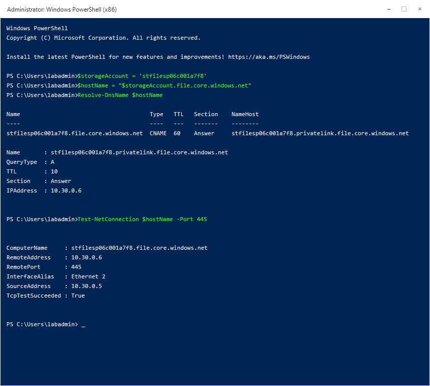

# Workshop 2: Azure Files

This workshop uses an isolated Azure environment. A Windows Server VM simulates a source file server, a second Windows Server VM acts as the client, and an SMB Azure file share is exposed only through a private endpoint. No customer-network connectivity is required.

Procedures and portal labels were checked against Microsoft Learn on **26 August 2026**. Azure portal experiences can change; use the linked Learn articles to confirm labels if the current portal differs.

## Outcomes

By the end of the workshop, participants can:

- Explain the protocol, performance, redundancy, and identity choices for Azure Files.
- Validate an SMB share that is reachable only through a private endpoint.
- Migrate a measured data set with Robocopy and verify the result.
- Recover data from a share snapshot and an Azure Backup recovery point.
- Interpret Azure Files metrics, logs, alerts, capacity, and throttling signals.
- Diagnose DNS, TCP 445, credentials, network access, permissions, and service health.
- Decide when Azure File Sync is appropriate.

> This disposable lab mounts SMB with a storage account key. Microsoft recommends identity-based authentication for production. Microsoft Entra Kerberos is a design discussion here because it requires tenant-level configuration and supported client identities.

## Schedule

| Time | Activity |
|---|---|
| 09:00-10:00 | Foundations and design decisions |
| 10:00-11:00 | Lab 1: Validate a private SMB share |
| 11:00-12:00 | Lab 2: Migrate and validate data |
| 12:00-13:00 | Lunch |
| 13:00-13:20 | Azure File Sync decision exercise |
| 13:20-14:20 | Lab 3: Protect and recover files |
| 14:20-15:20 | Lab 4: Harden, monitor, and troubleshoot |
| 15:20-16:20 | Lab 5: Incident scenarios |
| 16:20-16:45 | Review and cleanup |

## Architecture


## Assigned Environment

Replace `NN` with your two-digit participant number. Do not use another participant's subscription.

| Item | Assigned value |
|---|---|
| Participant | `pNN` |
| Subscription | Listed in your workshop assignment |
| Region | `Sweden Central` |
| Resource group | `rg-lab-files-pNN` |
| Virtual network | `vnet-lab-files-pNN` |
| Subnet | `snet-workload` |
| Client VM | `vm-filesclient-pNN` |
| Source VM | `vm-fileserver-pNN` |
| Storage account | Listed in your workshop assignment; begins `stfilespNN` |
| File share | `workshop` |
| Private endpoint | `pe-files-pNN` |
| Private DNS zone | `privatelink.file.core.windows.net` |
| Recovery Services vault | `rsv-lab-files-pNN` |
| Log Analytics workspace | `log-lab-files-pNN` |
| Action group | `ag-lab-files-pNN` |

## Sign In and Connect to the VMs

1. Open [Azure portal](https://portal.azure.com) in an InPrivate or Incognito window.
2. Sign in with the Workshop 2 account listed in your workshop assignment and change the temporary password when prompted.
3. In the search box at the top of the portal, enter `Subscriptions`, and then select **Subscriptions** under **Services**.
4. In the subscription list, select the subscription listed in your workshop assignment. On its **Overview** page, confirm that the **Subscription ID** matches your assigned subscription.
5. In the portal search box, enter `Resource groups`, and then select **Resource groups** under **Services**.
6. If resource groups from several subscriptions are shown, select **Add filter**, choose **Subscription**, select only your assigned subscription, and then select **Apply**.
7. Select `rg-lab-files-pNN`. On the resource-group **Overview** page, locate these two virtual machines:
    - `vm-filesclient-pNN` - the client VM used first for SMB connectivity and recovery exercises.
    - `vm-fileserver-pNN` - the source VM used later for the Robocopy migration exercise.
8. Select `vm-filesclient-pNN`. On the VM **Overview** page, confirm that **Status** is **Running**. If it is stopped, select **Start** and wait until the status changes to **Running**.
9. Select **Connect > Bastion**.
10. For **Authentication Type**, select **VM Password**, enter the VM administrator credentials listed in your workshop assignment, and select **Connect**.
11. Bastion Developer opens the Windows desktop in the browser and permits one VM connection at a time. When a later task requires `vm-fileserver-pNN`, disconnect from the client VM, return to `rg-lab-files-pNN`, open `vm-fileserver-pNN`, confirm that it is running, and repeat steps 9-10.

## Lab 1: Validate a Private SMB Share

**Time:** 60 minutes  
**Purpose:** Verify storage configuration, private endpoint routing, DNS, and SMB access before moving data.

### Task 1: Inspect the storage and share configuration

1. In the search box at the top of the Azure portal, enter `Storage accounts`.
2. Under **Services**, select **Storage accounts**.
3. In the storage-account list, select the account whose name begins with `stfilespNN`. In your workshop notes, record the complete storage account name exactly as displayed.
4. On the storage-account **Overview** page, find the **Essentials** section.
5. In your workshop notes, record the values for **Performance**, **Replication**, **Account kind**, and **Location**.
6. In the storage account's left menu, under **Settings**, select **Configuration**.
7. On the **Configuration** page, verify each setting below. Do not change any setting.
    - **Secure transfer required** is **Enabled**.
    - **Minimum TLS version** is **Version 1.2** or later.
    - **Allow storage account key access** is **Enabled** for this disposable lab.
    - **Hierarchical namespace** is **Disabled**.
8. In the left menu, under **Data storage**, select **Classic file shares**.
9. In the file-share list, select the share named `workshop`.
10. On the share **Overview** page, select the **Capabilities** tab.
11. Select the **Soft delete** tile. In the **Soft delete** pane, confirm that **Soft delete for all classic file shares** is **Enabled** and record the **Classic file share retainment period in days**. Select **Discard** or close the pane without making changes.
12. Select the **Properties** tab. Under **Size**, record **Maximum storage (GiB)**, **Used storage capacity (GiB)**, and **Access tier**.
13. Under **SMB protocol settings**, record **Security profile**, **SMB protocol versions**, and **SMB channel encryption** exactly as displayed. A dash (`-`) means that the portal is not showing a specific configured value.
14. In the breadcrumb at the top of the page, select the previous page to return to the file-share list.

**Evidence:** Record the storage settings and explain why account-key access is an exception for this lab rather than the production recommendation.

### Task 2: Inspect the private endpoint and DNS path

1. If the storage account is no longer open, use the portal search box to open **Storage accounts**, and then select your `stfilespNN...` account.
2. In the storage account's left menu, under **Security + networking**, select **Networking**.
3. On the **Public access** tab, find **Public network access** and confirm that it is **Disabled**. Do not change it.
4. At the top of the Networking page, select the **Private endpoints** tab.
5. In the connection list, find the row for `pe-files-pNN`.
6. Confirm that **Connection state** is **Approved**.
7. Select the private endpoint name `pe-files-pNN` to open the private endpoint resource.
8. On the private endpoint **Overview** page, under **Essentials**, confirm that **Target sub-resource** is `file`. This means the private endpoint connects to the storage account's Azure Files service rather than its Blob, Queue, or Table service.
9. In the private endpoint's left menu, under **Settings**, select **DNS configuration**.
10. Record the **Private IP address**. It should be in the lab network range `10.30.0.0/24`.
11. In the portal search box, enter `Private DNS zones`, and then select **Private DNS zones** under **Services**.
12. Select the zone named `privatelink.file.core.windows.net`.
13. In the zone's left menu, expand **DNS Management**, and then select **Recordsets**.
14. Find the A record whose name matches your storage account. Confirm that its IP address is the same private endpoint address recorded in step 10.
15. In the zone's left menu, under **DNS Management**, select **Virtual Network Links**.
16. Confirm that the link for `vnet-lab-files-pNN` is present and its **Link status** is **Completed**.

### Task 3: Validate DNS and TCP 445

1. Return to the Bastion browser tab connected to `vm-filesclient-pNN`.
2. If no client VM session is open, return to `rg-lab-files-pNN`, select `vm-filesclient-pNN`, and connect using **Connect > Bastion**.
3. On the Windows desktop, select **Start**, enter `Windows PowerShell`, and select **Windows PowerShell** from the search results.
4. Replace `<assigned-storage-account>` below with the complete storage account name you recorded in Task 1, step 3. Do not include angle brackets.
5. Paste the following commands into PowerShell, and then press **Enter**:

```powershell
$storageAccount = '<assigned-storage-account>'
$hostName = "$storageAccount.file.core.windows.net"
Resolve-DnsName $hostName
Test-NetConnection $hostName -Port 445
```



6. In the `Resolve-DnsName` output, confirm that the standard hostname points to a name ending in `privatelink.file.core.windows.net` and returns the private IP recorded in Task 2.
7. In the `Test-NetConnection` output, confirm that `RemotePort` is `445` and `TcpTestSucceeded` is `True`.
8. If either check fails, verify that `$storageAccount` exactly matches the name recorded in Task 1 and run both commands once more. If the result still fails, record the DNS output and `TcpTestSucceeded` value, do not attempt to mount the share, and continue with the portal-only steps in Lab 3.

> Always mount the standard `file.core.windows.net` hostname. Do not mount the `privatelink` hostname directly.

### Task 4: Mount the share

1. Return to the Azure portal tab.
2. In the portal search box, enter `Storage accounts`, select **Storage accounts**, and then select your `stfilespNN...` account.
3. In the storage account's left menu, under **Security + networking**, select **Access keys**.
4. At the top of the Access keys page, select **Show keys**.
5. Under **key1**, select the **Copy to clipboard** button next to **Key**. Do not place the key in notes, chat, or screenshots.
6. Return to the Bastion tab for `vm-filesclient-pNN` and the Windows PowerShell window opened in Task 3.
7. Run `$storageAccount` and confirm that it displays the complete storage account name you recorded in Task 1, step 3. If it is blank or incorrect, replace `<assigned-storage-account>` with that recorded name and run `$storageAccount = '<assigned-storage-account>'`. Do not include angle brackets.
8. Paste the following commands, and then press **Enter**:

```powershell
$shareName = 'workshop'
$key = Read-Host 'Paste storage account key' -AsSecureString
$credential = [pscredential]::new("Azure\$storageAccount", $key)
New-PSDrive -Name Z -PSProvider FileSystem `
    -Root "\\$storageAccount.file.core.windows.net\$shareName" `
    -Credential $credential -Persist
New-Item Z:\Department, Z:\Migration, Z:\Recovery -ItemType Directory -Force
Get-ChildItem Z:\
```

9. When PowerShell displays `Paste storage account key`, right-click once inside the PowerShell window to paste the key, and then press **Enter**. The key remains hidden while you type or paste it.
10. Confirm that the `Z:` drive is created and that `Department`, `Migration`, and `Recovery` appear in the `Get-ChildItem` output.
11. Create and read a client test file:

```powershell
Set-Content Z:\Department\client-test.txt 'Created from the client VM'
Get-Content Z:\Department\client-test.txt
```

12. Confirm that PowerShell displays `Created from the client VM`.
13. Close the client VM's Bastion browser tab. Bastion Developer supports only one active VM connection at a time.
14. In the Azure portal, return to `rg-lab-files-pNN` and select `vm-fileserver-pNN`.
15. On the source VM **Overview** page, confirm that **Status** is **Running**. If necessary, select **Start** and wait for **Running**.
16. Select **Connect > Bastion**, choose **VM Password**, enter the VM administrator credentials listed in your workshop assignment, and select **Connect**.
17. On the source VM desktop, select **Start**, enter `Windows PowerShell`, and open **Windows PowerShell**.
18. Replace `<assigned-storage-account>` with the complete storage account name recorded in Task 1, step 3, and run the following commands. Do not include angle brackets.

```powershell
$storageAccount = '<assigned-storage-account>'
$hostName = "$storageAccount.file.core.windows.net"
Resolve-DnsName $hostName
Test-NetConnection $hostName -Port 445
```

19. Confirm that `Resolve-DnsName` returns the private endpoint IP recorded in Task 2 and that `TcpTestSucceeded` is `True`.
20. Return to the Azure portal tab. In the portal search box, enter `Storage accounts`, select **Storage accounts**, and then select your `stfilespNN...` account. Under **Security + networking**, select **Access keys**, select **Show keys**, and under **key1**, select the **Copy to clipboard** button next to **Key**.
21. Return to the source VM's Bastion tab. Paste the following commands into PowerShell, and then press **Enter**:

```powershell
$shareName = 'workshop'
$key = Read-Host 'Paste storage account key' -AsSecureString
$credential = [pscredential]::new("Azure\$storageAccount", $key)
New-PSDrive -Name Z -PSProvider FileSystem `
    -Root "\\$storageAccount.file.core.windows.net\$shareName" `
    -Credential $credential -Persist
Get-ChildItem Z:\
```

22. When PowerShell displays `Paste storage account key`, right-click once inside the PowerShell window to paste the key, and then press **Enter**. Confirm that the `Z:` drive is created.
23. Verify that the source VM can read the test file created by the client VM:

```powershell
Get-Content Z:\Department\client-test.txt
```

24. Confirm that the output is `Created from the client VM`.
25. Create and read a source VM test file:

```powershell
Set-Content Z:\Department\source-test.txt 'Created from the source VM'
Get-Content Z:\Department\source-test.txt
```

26. Confirm that the output is `Created from the source VM`. Leave this PowerShell window open for Lab 2.

**Pass criteria:** Both VMs resolve the private endpoint, TCP 445 succeeds, and each can create and read a test file through `Z:`.

## Lab 2: Migrate and Validate Data

**Time:** 60 minutes  
**Purpose:** Perform a measured and verifiable migration from the simulated source server.

### Task 1: Inventory the source

1. Continue in the Bastion session for `vm-fileserver-pNN` that you opened at the end of Lab 1.
2. If that session is closed, return to `rg-lab-files-pNN`, select `vm-fileserver-pNN`, select **Connect > Bastion**, and sign in using the VM administrator credentials listed in your workshop assignment.
3. On the Windows desktop, select **Start**, enter `Windows PowerShell`, and open **Windows PowerShell**.
4. Confirm that the `Z:` drive is mounted by running `Get-PSDrive Z`. If PowerShell reports that drive `Z` does not exist, repeat the mount procedure from Lab 1, Task 4 before continuing.
5. The pre-stage process created nested paths, an empty folder, long names, text files, and a 5 MiB binary file under `C:\LabSource`. Paste the following inventory commands into PowerShell, and then press **Enter**:

```powershell
$source = 'C:\LabSource'
$sourceFiles = Get-ChildItem $source -File -Recurse
$sourceInventory = [pscustomobject]@{
    FileCount   = $sourceFiles.Count
    FolderCount = (Get-ChildItem $source -Directory -Recurse).Count
    TotalBytes  = ($sourceFiles | Measure-Object Length -Sum).Sum
    LargestFile = ($sourceFiles | Sort-Object Length -Descending | Select-Object -First 1).FullName
}
$sourceInventory | Format-List
```

6. Record the four displayed values in your workshop notes.
7. For the standard lab dataset, confirm that **FileCount** is `42`, **FolderCount** is `11`, **TotalBytes** is `5348317`, and **LargestFile** is `C:\LabSource\Engineering\engineering-payload.bin`. If any value differs, run the inventory commands once more. If it still differs, record the actual values and stop Lab 2 because the migration validation depends on the standard source dataset.
8. In your notes, identify one business process that might keep files open and therefore require a planned cutover window during a real migration.

### Task 2: Run the initial copy

1. Stay in the PowerShell window on `vm-fileserver-pNN`.
2. Paste the following commands, and then press **Enter**. The copy may take a few minutes:

```powershell
$log = 'C:\LabLogs\robocopy-initial.log'
New-Item -ItemType Directory -Path (Split-Path $log) -Force | Out-Null
$stopwatch = [Diagnostics.Stopwatch]::StartNew()
robocopy C:\LabSource Z:\Migration /E /COPY:DAT /DCOPY:DAT /R:2 /W:2 /MT:8 /TEE /LOG:$log
$exitCode = $LASTEXITCODE
$stopwatch.Stop()
[pscustomobject]@{
    RobocopyExitCode = $exitCode
    ElapsedSeconds   = [math]::Round($stopwatch.Elapsed.TotalSeconds, 2)
}
```

3. Wait until Robocopy finishes. If PowerShell displays `>> }` after the last pasted line, press **Enter** once to run the completed summary command. Do not press **Ctrl+C**. Confirm that the summary object displays **RobocopyExitCode** and **ElapsedSeconds**.
4. Confirm that **RobocopyExitCode** is between `0` and `7`. These values indicate success or an informational result. For a value of `8` or higher, run `Get-Content C:\LabLogs\robocopy-initial.log -Tail 30`, record the output, and stop Lab 2 without running the delta copy.
5. Review the last 20 lines of the saved log:

```powershell
Get-Content C:\LabLogs\robocopy-initial.log -Tail 20
```

6. In the Robocopy summary, find the **Files** row and confirm that **Mismatch**, **Failed**, and **Extras** are all `0`. On the first run, the standard lab dataset should show **Total** `42`, **Copied** `42`, and **Skipped** `0`. If you repeat the command after a successful copy without changing any files, **Copied** `0` and **Skipped** `42` is expected.
7. Record **Copied**, **Skipped**, **Mismatch**, **Failed**, **Extras**, **RobocopyExitCode**, and **ElapsedSeconds** in your workshop notes. If you accidentally pressed **Ctrl+C** after `$stopwatch.Stop()`, run the following command to display the saved values:

```powershell
[pscustomobject]@{
    RobocopyExitCode = $exitCode
    ElapsedSeconds   = [math]::Round($stopwatch.Elapsed.TotalSeconds, 2)
} | Format-List
```

### Task 3: Validate counts, bytes, and hashes

1. Stay in the PowerShell window on `vm-fileserver-pNN`.
2. Paste the following validation commands, and then press **Enter**:

```powershell
$destination = 'Z:\Migration'
$destinationFiles = Get-ChildItem $destination -File -Recurse
$destinationInventory = [pscustomobject]@{
    FileCount   = $destinationFiles.Count
    FolderCount = (Get-ChildItem $destination -Directory -Recurse).Count
    TotalBytes  = ($destinationFiles | Measure-Object Length -Sum).Sum
}
$sourceInventory
$destinationInventory

$sourceHashes = Get-ChildItem C:\LabSource -File -Recurse | ForEach-Object {
    [pscustomobject]@{
        RelativePath = $_.FullName.Substring('C:\LabSource'.Length)
        Hash = (Get-FileHash $_.FullName -Algorithm SHA256).Hash
    }
}
$destinationHashes = Get-ChildItem Z:\Migration -File -Recurse | ForEach-Object {
    [pscustomobject]@{
        RelativePath = $_.FullName.Substring('Z:\Migration'.Length)
        Hash = (Get-FileHash $_.FullName -Algorithm SHA256).Hash
    }
}
Compare-Object $sourceHashes $destinationHashes -Property RelativePath, Hash
```

3. Compare the displayed source and destination inventories. Confirm that **FileCount**, **FolderCount**, and **TotalBytes** have the same values on both sides.
4. Look immediately below the `Compare-Object` command. The expected result is no output followed by a new PowerShell prompt; this means every relative path and SHA256 hash matches.
5. If the inventory values differ or `Compare-Object` displays any rows, run the initial-copy command from Task 2 once more and repeat the validation commands. If the values or hashes still differ, run `Get-Content C:\LabLogs\robocopy-initial.log -Tail 30`, record the output, and stop Lab 2 without running the delta copy.

### Task 4: Run a delta copy

1. Stay in the PowerShell window on `vm-fileserver-pNN`.
2. The next commands simulate three changes after the initial migration: one modified file, one new file, and one deleted source file.
3. Paste the following commands, and then press **Enter**:

```powershell
Add-Content C:\LabSource\Finance\sample-003.txt 'Delta change'
Set-Content C:\LabSource\Finance\new-after-initial.txt 'New file'
Remove-Item C:\LabSource\HR\Policies\sample-002.txt -ErrorAction SilentlyContinue
robocopy C:\LabSource Z:\Migration /E /COPY:DAT /DCOPY:DAT /R:2 /W:2 /MT:8 /TEE /LOG:C:\LabLogs\robocopy-delta.log
"Robocopy exit code: $LASTEXITCODE"
```

4. Wait for the robocopy summary and confirm that the exit code is between `0` and `7` and the **Failed** count is `0`.
5. Review the saved delta log:

```powershell
Get-Content C:\LabLogs\robocopy-delta.log -Tail 20
```

6. Confirm that changed files were copied and unchanged files were skipped.
7. Confirm that the source deletion was not repeated at the destination:

```powershell
Test-Path Z:\Migration\HR\Policies\sample-002.txt
```

8. Confirm that the command returns `True`. The destination file remains because `/MIR` was deliberately not used.
9. In your notes, describe the safe real-world sequence: schedule downtime, stop writes, run a final delta copy, validate the destination, switch users to Azure Files, and keep the source available for rollback until acceptance is complete.

**Pass criteria:** Initial counts, bytes, and hashes match; the delta run copies changed files; and the participant can explain how downtime, final delta, validation, and rollback fit into cutover.

## Azure File Sync Decision Exercise

**Time:** 20 minutes, guided discussion. No deployment.

1. In your workshop notes, write the question: **After migration, will Windows file servers remain in the environment?**
2. If the answer is **Yes**, record whether local caching, branch-office access, or a low-downtime transition is required. These are reasons to consider Azure File Sync.
3. If the answer is **No**, record **Direct Azure Files access** as the simpler target. Use a measured copy method such as Robocopy or AzCopy and avoid a permanent synchronization dependency.
4. Record that cloud tiering manages local disk capacity but does not replace backup.
5. Record the operational work introduced by Azure File Sync: agent updates, server registration, sync-health monitoring, files-not-syncing investigation, cloud-tiering policy tuning, and file recall planning.

## Lab 3: Protect and Recover Files

**Time:** 60 minutes  
**Purpose:** Compare self-managed snapshots with policy-managed snapshot-tier Azure Backup.

### Task 1: Create and use a share snapshot

1. Close the Bastion tab for `vm-fileserver-pNN` if it is still open.
2. In the Azure portal, open `rg-lab-files-pNN`, and then select `vm-filesclient-pNN`.
3. Confirm that the VM status is **Running**, select **Connect > Bastion**, and sign in using the VM administrator credentials listed in your workshop assignment.
4. On the client VM desktop, select **Start**, enter `Windows PowerShell`, and open **Windows PowerShell**.
5. Confirm that drive `Z:` is mounted by running `Get-PSDrive Z`. If it is missing, repeat the mount procedure from Lab 1, Task 4.
6. Paste the following commands to create two recovery test files, and then press **Enter**:

```powershell
New-Item Z:\Recovery -ItemType Directory -Force | Out-Null
Set-Content Z:\Recovery\quarterly-plan.txt 'Quarterly plan version 1'
Set-Content Z:\Recovery\delete-me.txt 'Snapshot recovery sample'
```

7. Confirm both files contain version 1 data:

```powershell
Get-Content Z:\Recovery\quarterly-plan.txt
Get-Content Z:\Recovery\delete-me.txt
```

8. Return to the Azure portal tab. In the portal search box, enter `Storage accounts`, select **Storage accounts**, and then select your `stfilespNN...` account.
9. In the storage account's left menu, under **Data storage**, select **Classic file shares**.
10. Select the `workshop` share.
11. In the share's left menu, under **Operations**, select **Snapshots**.
12. On the toolbar, select **+ Add snapshot**.
13. In the pane, enter `Before Lab 3 changes` in **Comment**, and then select **OK** or **Create**. Wait for the success notification.
14. Return to the client VM PowerShell window and simulate a changed and deleted file:

```powershell
Set-Content Z:\Recovery\quarterly-plan.txt 'Quarterly plan version 2'
Remove-Item Z:\Recovery\delete-me.txt
Get-ChildItem Z:\Recovery
```

15. Confirm that `quarterly-plan.txt` remains and `delete-me.txt` is no longer listed.
16. Return to the portal's **Snapshots** page and select **Refresh** if the new snapshot is not visible.
17. Select the snapshot with comment `Before Lab 3 changes`.
18. In the snapshot file browser, select the `Recovery` folder and then select `quarterly-plan.txt`.
19. Select **Download**. The portal runs in your local browser, so the file is saved to your local computer's Downloads folder, not to the Bastion VM.
20. Open the downloaded file locally and confirm its content is `Quarterly plan version 1`. Rename it locally to `quarterly-plan-snapshot.txt` so it cannot be confused with the live version.
21. Do not select **Restore > Overwrite original file** in this exercise. That action replaces the live file and should be used only with explicit approval.
22. Return to the Bastion client VM. Open **File Explorer**, browse to `Z:\Recovery`, right-click the folder, and select **Properties**.
23. If **Previous Versions** is available, select the snapshot created in step 13, select **Open**, copy `delete-me.txt`, and paste it into the live `Z:\Recovery` folder as `delete-me-restored.txt`.
24. If **Previous Versions** is absent or no snapshot is listed, record that observation and continue to Task 2. Do not treat it as a lab failure because client and portal versions can expose the feature differently.

### Task 2: Inspect Azure Backup protection

1. In the Azure portal search box, enter `rsv-lab-files-pNN`, replacing `NN` with your participant number.
2. Select the Recovery Services vault `rsv-lab-files-pNN` from the search results.
3. On the vault **Overview** page, select **Backup** from the toolbar or the left menu.
4. Find the protected datasource. Depending on the current portal version, its type can appear as **Azure Files (Azure Storage)** or **Azure Storage (Azure Files)**. Both labels refer to the Azure file share.
5. In the vault's left menu, under **Resiliency**, select **Protected inventory**, and then select **Protected items**.
6. At the top of the protected-items list, set **Datasource type** to **Azure Storage (Azure Files)**. If the portal uses the reverse label, select **Azure Files (Azure Storage)** instead.
7. Select the protected item for the `workshop` share.
8. On its details page, confirm that **Protection status** is healthy or protected and that the policy is `pol-files-snapshot-lab`.
9. Select the policy name and confirm that the backup tier is **Snapshot** and retention is **7 days**. Use the browser's **Back** button once to return to the protected item.
10. On the protected-item toolbar, select **Backup now**.
11. In the **Backup now** pane, set **Retain backup till** to a date seven days from today, and then select **OK** or **Backup now**.
12. Wait for the notification that the backup job was submitted.
13. In the vault's left menu, under **Resiliency**, select **Monitoring + Reporting**, and then select **Jobs**.
14. Find the newest Azure Files backup job. Select **Refresh** periodically until **Status** changes from **In progress** to **Completed**.
15. If the job changes to **Failed** or **Completed with warnings**, select the job and record its **Status**, **Error code**, and **Error message**. Return to the protected `workshop` item and use an earlier completed recovery point in Task 3. If no completed recovery point is available, skip Task 3 and continue to Lab 4.

### Task 3: Restore an individual file to an alternate location

1. In the Recovery Services vault's left menu, under **Resiliency**, select **Protected inventory**, and then select **Protected items**.
2. Set **Datasource type** to the Azure Files label used by your portal.
3. Select the protected `workshop` item.
4. On the protected-item toolbar, select **File Recovery**. If the toolbar is collapsed, select the ellipsis (**...**) and then **File Recovery**.
5. Under **Restore Point**, select **Select**.
6. In the recovery-point pane, select the newest completed snapshot-tier recovery point, and then select **OK**.
7. Under **Recovery Destination**, select **Alternate Location**.
8. In **Storage account**, select your assigned `stfilespNN...` account.
9. In **File share**, select `workshop`.
10. In **Folder Name**, enter `BackupRestore`.
11. Select **Add File**.
12. In the file browser, open `Recovery`, select `quarterly-plan.txt`, and then select **Select**.
13. For conflict resolution, select **Skip**. This prevents an existing destination file from being overwritten.
14. Review the recovery point, destination, and selected file, and then select **Restore**.
15. Wait for the notification that the restore job was submitted.
16. In the vault's left menu, under **Resiliency**, select **Monitoring + Reporting**, and then select **Jobs**.
17. Find the newest restore job and select **Refresh** until **Status** is **Completed**. If it changes to **Failed** or **Completed with warnings**, select the job, record its **Status**, **Error code**, and **Error message**, skip the recovered-file comparison, and continue to Lab 4.
18. Return to the Bastion tab connected to `vm-filesclient-pNN` and open Windows PowerShell if needed.
19. Locate the recovered file and compare its content with the current live file:

```powershell
Get-ChildItem Z:\BackupRestore -File -Recurse
Get-Content Z:\Recovery\quarterly-plan.txt
Get-Content (Get-ChildItem Z:\BackupRestore -Filter quarterly-plan.txt -File -Recurse | Select-Object -First 1).FullName
```

20. Confirm that the live file contains `Quarterly plan version 2` and the restored copy contains `Quarterly plan version 1`.
21. Record the recovery-point time and alternate destination in your workshop notes.

**Pass criteria:** A deleted or changed item is recovered without unintentionally overwriting current data, and the participant identifies the recovery point and destination used.

## Lab 4: Harden, Monitor, and Troubleshoot

**Time:** 60 minutes  
**Purpose:** Review security controls and investigate the client, network, service, and capacity layers.

### Task 1: Review hardening controls

1. In the Azure portal search box, enter `Storage accounts`, select **Storage accounts**, and then select your `stfilespNN...` account.
2. In the storage account's left menu, under **Security + networking**, select **Networking**.
3. On the **Public access** tab, confirm that **Public network access** is **Disabled**.
4. Select the **Private endpoints** tab and confirm that `pe-files-pNN` is **Approved**.
5. In the left menu, under **Settings**, select **Configuration**.
6. Confirm that **Secure transfer required** is **Enabled** and **Minimum TLS version** is **Version 1.2** or later.
7. In the left menu, under **Data storage**, select **Classic file shares**.
8. Select `workshop`, select the **Capabilities** tab, and then select the **Soft delete** tile. Record the enabled state and retention period, and then select **Discard** or close the pane without making changes.
9. In the storage account's left menu, select **Access control (IAM)**.
10. Select the **Role assignments** tab and use the **Role** column to identify assignments that can read or manage the account. Record one relevant role and assignee without recording credentials.
11. In the left menu, under **Security + networking**, select **Access keys**.
12. Select **Rotate and synchronize keys** or its information link to review the guidance. Do not select a **Rotate key** button during the lab.
13. In your notes, list the production improvements: identity-based SMB authentication, least-privilege roles, protected key operations, and an inventory of applications that still require account keys.

### Task 2: Analyze metrics

> Azure Files metrics can be account-scoped or share-scoped. A **File Share** dimension can be unavailable for this pay-as-you-go share. If that dimension is absent, continue with account-scoped metrics and record the scope.

1. In the storage account's left menu, under **Monitoring**, select **Metrics**.
2. Above the chart, set the time range to **Last 30 minutes** and select **Apply**.
3. Select **+ Add metric**.
4. In **Metric Namespace**, select **File** or **File standard metrics**. Portal wording can vary.
5. In **Metric**, select **Transactions**. Leave **Aggregation** at its default value.
6. Select **Apply splitting**.
7. In **Values**, select **Response type**. If the portal permits a second split, also select **API name**, and then select **Apply**.
8. Review the chart and legend. Look for response types such as `ClientThrottleError` or `ServerBusy`; these should be absent or zero in the lab.
9. Remove the split or metric using its close (**x**) control.
10. Add and review these metrics one at a time: **Availability**, **Success E2E Latency**, **Success Server Latency**, **Ingress**, **Egress**, and **File Capacity**.
11. Compare **Success E2E Latency**, which includes the client path, with **Success Server Latency**, which measures service processing. A much larger E2E value, such as 500 ms versus 50 ms, points to delay outside the Azure Files service.
12. If **Apply splitting** offers a **File Share** dimension, select `workshop`. If it does not, leave the chart at account scope.
13. Record the metric scope, availability, both latency values, and whether any throttling response appeared.

### Task 3: Review diagnostics and alerts

1. In the storage account's left menu, under **Monitoring**, select **Diagnostic settings**.
2. Azure Storage can show separate services for blob, file, queue, and table. Select the row or link named **File** if a service-selection page appears.
3. In the diagnostic-settings list, select `diag-files-pNN`.
4. Confirm that all available log categories and **AllMetrics** are selected and that **Send to Log Analytics workspace** points to `log-lab-files-pNN`. Select **Discard changes** or use the browser's **Back** button; do not save changes.
5. In the storage account's left menu, under **Monitoring**, select **Alerts**.
6. Select **Alert rules**, and then select `alert-files-availability-pNN`.
7. Confirm that **Scope** is your storage account or its file service. If it names another account or resource group, record the displayed scope, close the alert without saving changes, and continue to Task 4.
8. Confirm the condition uses **Availability**, **Average**, **Less than**, threshold `99.9`, evaluation frequency **5 minutes**, and lookback period **1 hour**.
9. Select the **Actions** tab or section and confirm that the action group is `ag-lab-files-pNN`. The lab action group may intentionally have no notification receiver.
10. Return to the Bastion tab connected to `vm-filesclient-pNN` and open Windows PowerShell if needed.
11. Run the following loop to generate SMB create and read operations for diagnostic logs:

```powershell
1..20 | ForEach-Object {
    Set-Content "Z:\Department\monitor-$_.txt" "monitor sample $_"
    Get-Content "Z:\Department\monitor-$_.txt" | Out-Null
}
```

12. Confirm the PowerShell prompt returns without red error text. Wait at least two minutes for log ingestion.
13. Return to the Azure portal. In the search box, enter `log-lab-files-pNN`, and then select the Log Analytics workspace with that name.
14. In the workspace's left menu, under **General**, select **Logs**.
15. If a **Queries hub** or welcome pane opens, close it using the **X** in its upper-right corner to show a blank query editor.
16. Above the editor, set **Time range** to **Last hour**.
17. Replace any text in the editor with the following query, and then select **Run**:

```kusto
StorageFileLogs
| where TimeGenerated > ago(1h)
| summarize Operations=count() by Protocol, OperationName, StatusText
| order by Operations desc
```

18. In the **Results** pane, confirm that a table appears with **Protocol**, **OperationName**, **StatusText**, and **Operations** columns. At least one row should have a positive operation count.
19. If no rows appear, wait another two to three minutes and select **Run** again. If the query displays an error, verify that the first line is exactly `StorageFileLogs`. If the table remains unavailable after ten minutes, record the query, time range, and displayed error or empty result, and continue to Task 4.

### Task 4: Use the troubleshooting ladder

1. Use `vm-filesclient-pNN`. Open Windows PowerShell using **Start > Windows PowerShell**.
2. Set the assigned account name, and then test name resolution:

```powershell
$storageAccount = '<assigned-storage-account>'
$hostName = "$storageAccount.file.core.windows.net"
Resolve-DnsName $hostName
```

3. **Name-resolution pass:** the output reaches `privatelink.file.core.windows.net` and returns the private endpoint IP. A missing record, public IP, or wrong private IP identifies the DNS layer as the likely failure.
4. Test transport:

```powershell
Test-NetConnection $hostName -Port 445
```

5. **Transport pass:** `TcpTestSucceeded` is `True`. `False` indicates routing, firewall, NSG, or private-endpoint reachability should be checked before credentials.
6. Check the mapped drive and cached credentials without displaying secrets:

```powershell
Get-PSDrive Z -ErrorAction SilentlyContinue
cmdkey /list
```

7. **Credential pass:** drive `Z:` exists and any cached entry refers to the assigned storage hostname. Do not paste or display the storage key while troubleshooting.
8. In the portal, open the storage account, select **Networking**, and confirm public access is disabled and `pe-files-pNN` is approved. Then open `privatelink.file.core.windows.net`, select **Virtual network links**, and confirm `vnet-lab-files-pNN` is linked.
9. **Network-access pass:** all three states match. If a state differs, record it as the first failed layer. Do not change Azure configuration in this diagnostic exercise.
10. Test file permissions from the client VM:

```powershell
$testPath = 'Z:\Department\permission-test.txt'
Set-Content $testPath 'permission test'
Get-Content $testPath
Remove-Item $testPath
```

11. **Permission pass:** the text is written, read, and deleted without an error. An `Access denied` result identifies an authorization or file-permission layer.
12. In the portal, return to the metrics from Task 2 and inspect availability, latency, capacity, and throttling responses.
13. **Service-state pass:** availability is healthy, used capacity is below the share's maximum storage, and no meaningful throttling appears.
14. Record the first failed layer and the evidence. Do not change configuration in this diagnostic exercise. Continue to Lab 5 after saving the result.

**Pass criteria:** Identify the failing layer, show the evidence, and propose a verification action before changing configuration.

## Lab 5: Incident Scenarios

**Time:** 60 minutes  
**Purpose:** Use evidence from the healthy lab environment to produce a response to a simulated incident.

This is a tabletop exercise. No fault is introduced into Azure, and the current environment is expected to remain healthy. The scenario facts describe a simulated production incident; portal data and command output from your lab provide the technical evidence for your response.

### Task 1: Select your scenario

Use the last digit of your participant number. Complete one scenario only:

| Participant number ends in | Scenario |
|---|---|
| `1` or `5` | Scenario A: Accidental deletion |
| `2` or `6` | Scenario B: Suspected ransomware |
| `3` or `7` | Scenario C: Capacity pressure |
| `4` or `8` | Scenario D: High latency |

### Task 2: Create the incident note

1. Open Notepad or your workshop notes on your local computer.
2. Add the heading `Lab 5 incident note - Scenario <letter>`.
3. Copy the table below into your notes.
4. Complete every row using the supplied scenario facts and the evidence you collect in Task 3. Do not change Azure configuration.

| Field | Required content |
|---|---|
| Impact | Users, paths, operations, and business effect |
| Time window | First observed time and last known-good time |
| Evidence | Commands, metrics, logs, jobs, or recovery points |
| Diagnosis | Failing layer and confidence level |
| Action | Containment and recovery decision |
| Validation | How correct service and data are proven |
| Prevention | Control, alert, process, or architecture change |

### Task 3: Investigate your scenario

#### Scenario A: Accidental deletion

**Simulated facts:** At 14:10, a user reported that `Department\Operations` was deleted. Twenty users cannot access current operating documents. The folder was last known to be present at 13:45.

1. Enter the simulated facts in the **Impact** and **Time window** rows of the incident note.
2. In the Azure portal search box, enter `rsv-lab-files-pNN`, replacing `NN` with your participant number, and open the matching Recovery Services vault.
3. In the vault's left menu, under **Resiliency**, select **Protected inventory**, and then select **Protected items**.
4. Set **Datasource type** to **Azure Storage (Azure Files)**. If your portal uses **Azure Files (Azure Storage)**, select that equivalent label.
5. Select the protected item for `workshop`, select **File Recovery**, and then select **Select** under **Restore Point**. Do not start a restore.
6. Record the newest recovery point from before 13:45 in the **Evidence** row. If no recovery point is from before 13:45, record the oldest available recovery point and state that it does not meet the requested recovery time. Close the pane without starting a restore.
7. In the **Diagnosis** row, identify accidental deletion as the likely data-layer failure and state your confidence level.
8. In the **Action** row, choose item-level recovery to an alternate path such as `BackupRestore`. State that the live path must not be overwritten until the restored files are checked.
9. In the **Validation** row, require confirmation of the expected folders, file count, file contents, timestamps, and permissions before copying data back.
10. In the **Prevention** row, propose least-privilege write access, deletion monitoring, and a documented item-recovery procedure.

#### Scenario B: Suspected ransomware

**Simulated facts:** At 14:10, users reported that files below `Department\Finance` had unfamiliar extensions and could not be opened. Normal access was last confirmed at 13:30. The affected client is still connected to the share.

1. Enter the simulated facts in the **Impact** and **Time window** rows of the incident note.
2. On `vm-filesclient-pNN`, open Windows PowerShell and run the following commands after replacing the placeholder with the storage account name recorded in Lab 1:

```powershell
$storageAccount = '<assigned-storage-account>'
Get-PSDrive Z
Test-NetConnection "$storageAccount.file.core.windows.net" -Port 445
```

3. Record the mapped-drive state and `TcpTestSucceeded` value in **Evidence**. These healthy results show that connectivity alone does not explain the simulated file changes.
4. In the portal, open `rsv-lab-files-pNN`. Under **Resiliency**, select **Protected inventory > Protected items**, set **Datasource type** to the Azure Files label, and select `workshop`.
5. Select **File Recovery**, and then select **Select** under **Restore Point**. Record the newest recovery point from before 13:30. If none exists, record that the recovery-point objective cannot be met. Close the pane without starting a restore.
6. In **Diagnosis**, identify suspected malicious data modification and state that the connected client is a possible source that requires investigation.
7. In **Action**, propose isolating the affected client from the network, preserving logs and snapshots, blocking further writes using the organization's incident procedure, and recovering the selected point to an alternate location. Do not run a ransomware simulation or delete evidence.
8. In **Validation**, require malware scanning plus checks of file names, file contents, file count, timestamps, and permissions before a controlled cutover.
9. In **Prevention**, compare the lab's snapshot-tier protection with isolated vaulted backup and immutability, then propose endpoint protection, least privilege, and an alert for unusual file operations.

#### Scenario C: Capacity pressure

**Simulated facts:** At 14:10, an application owner reported failed writes to `Department\Engineering`. Capacity has grown steadily for four weeks and no capacity alert was received.

1. Enter the simulated facts in the **Impact** and **Time window** rows of the incident note. Use 14:10 as the first observed time and 13:45 as the last known-good time.
2. In the storage account's left menu, under **Data storage**, select **Classic file shares**, and then select `workshop`.
3. On the share **Overview** page, under **Size**, record **Maximum storage (GiB)** and **Used storage capacity (GiB)** in **Evidence**.
4. Select **Metrics**, display **File Capacity**, and record the value, time range, chart trend, and whether the metric is account- or share-scoped.
5. In **Diagnosis**, explain whether the current lab evidence supports actual capacity exhaustion. Keep the simulated four-week growth report separate from the live lab metric.
6. In **Action**, propose an immediate capacity increase or removal of approved obsolete data, based on retention policy. Do not delete lab data.
7. In **Validation**, require a successful test write and confirmation that used capacity remains below the maximum with operating headroom.
8. In **Prevention**, specify a capacity alert threshold, such as 80 percent, and explain why it leaves time to respond.

#### Scenario D: High latency

**Simulated facts:** At 14:10, users reported that opening files from `Department\Engineering` takes more than 20 seconds. The service was last known to respond normally at 13:45.

1. Enter the simulated facts in the **Impact** and **Time window** rows of the incident note.
2. In the storage account's **Metrics** page, display **Success E2E Latency** and **Success Server Latency** over the same time range. Record both values in **Evidence**.
3. On `vm-filesclient-pNN`, open Windows PowerShell and run the following commands after replacing the placeholder with the storage account name recorded in Lab 1:

```powershell
$storageAccount = '<assigned-storage-account>'
$hostName = "$storageAccount.file.core.windows.net"
Resolve-DnsName $hostName
Test-NetConnection $hostName -Port 445
```

4. Record the resolved private IP and `TcpTestSucceeded` value in **Evidence**.
5. In **Metrics**, display **Transactions**, select **Apply splitting**, choose **Response type**, and check for throttling responses. Record the result.
6. In **Diagnosis**, compare end-to-end latency with server latency. A much higher end-to-end value points toward the client or network path; similar high values point toward the service or workload.
7. In **Action**, choose one response supported by the evidence: investigate the network path, change the workload pattern, use provisioned performance, change the storage tier, or evaluate Azure File Sync caching.
8. In **Validation**, repeat the latency, DNS, TCP 445, and transaction checks and confirm that user-observed open time returns to the agreed target.
9. In **Prevention**, propose latency and throttling alerts plus a documented performance baseline.

### Task 4: Complete the incident note

1. Review your completed incident note and ensure it contains no passwords, account keys, or other secrets.
2. Confirm that all seven rows contain scenario-specific content rather than general Azure Files guidance.
3. Under the table, write `Strongest evidence:` followed by the metric, command result, recovery point, or portal value that most strongly supports the diagnosis.
4. Write `Disproving evidence:` followed by one result that would show the diagnosis is wrong.
5. Save the completed incident note with your workshop evidence.

**Pass criteria:** The saved note contains all seven completed rows, one strongest-evidence statement, one disproving-evidence statement, and no secrets. No Azure configuration change or simulated destructive action is required.

## Cleanup

Do not delete the resource group or any Azure resource. Environment deletion is performed separately after the workshop.

### Participant steps

1. Save your notes, screenshots, incident note, and any locally downloaded recovery file outside the disposable lab VMs. Do not include passwords or storage account keys.
2. On `vm-filesclient-pNN`, open Windows PowerShell and remove the mapped drive:

```powershell
Remove-PSDrive Z -Force -ErrorAction SilentlyContinue
```

3. Run `Get-PSDrive Z -ErrorAction SilentlyContinue` and confirm that it returns no output.
4. If you created a persistent credential with `cmdkey`, list entries using `cmdkey /list`. If an entry exactly matches your assigned storage hostname, replace `<assigned-storage-account>` below and remove only that entry. Skip these commands if no matching entry exists.

```powershell
$storageAccount = '<assigned-storage-account>'
$storageHost = "$storageAccount.file.core.windows.net"
cmdkey /delete:$storageHost
```
5. Close the client VM Bastion tab, return to `rg-lab-files-pNN`, select `vm-fileserver-pNN`, and connect through **Connect > Bastion**.
6. Open Windows PowerShell and repeat steps 2-4 on the source VM.
7. Close the source VM Bastion tab.
8. Confirm that your notes and screenshots are saved outside the lab VMs, and then stop. Participants must not delete the resource group, Recovery Services vault, protected item, or storage account.

## Microsoft Learn References

- [Configure Azure Files network endpoints](https://learn.microsoft.com/azure/storage/files/storage-files-networking-endpoints)
- [Mount an SMB Azure file share on Windows](https://learn.microsoft.com/azure/storage/files/storage-how-to-use-files-windows)
- [Use Azure Files share snapshots](https://learn.microsoft.com/azure/storage/files/storage-snapshots-files)
- [Back up Azure Files in the Azure portal](https://learn.microsoft.com/azure/backup/backup-azure-files)
- [Restore Azure Files with Azure Backup](https://learn.microsoft.com/azure/backup/restore-afs)
- [Monitor Azure Files using Azure Monitor](https://learn.microsoft.com/azure/storage/files/storage-files-monitoring)
- [Create Azure Files monitoring alerts](https://learn.microsoft.com/azure/storage/files/files-monitoring-alerts)
- [Bastion Developer quickstart](https://learn.microsoft.com/azure/bastion/quickstart-developer-sku)
- [Plan an Azure File Sync deployment](https://learn.microsoft.com/azure/storage/file-sync/file-sync-planning)
